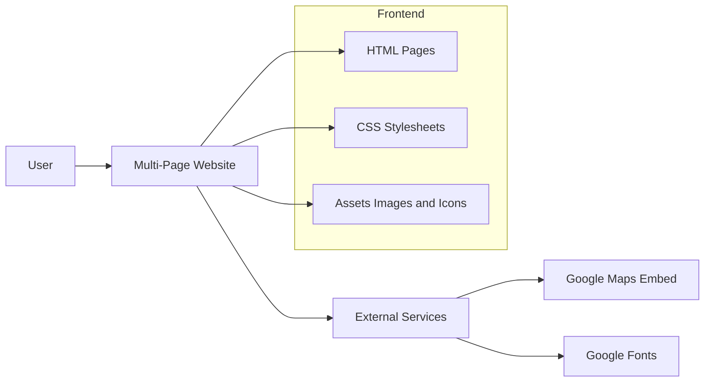

# University of Sheffield Guide

A responsive campus guide website designed to help students explore food spots, picnic areas, and key locations around the University of Sheffield.

Developed as part of the COM1008 Web and Internet Technology module, this project focuses on building a fully functional website using **pure HTML and CSS**, without relying on frameworks.

 

> [!NOTE]
> This project intentionally avoids JavaScript frameworks to emphasise strong fundamentals in semantic HTML, responsive design, and accessibility.

 

## Overview

The website provides a structured and user-friendly guide to campus life, including:

- Food & drink locations around campus  
- Picnic spots and green spaces  
- An interactive quiz experience built with HTML and CSS  
- Supporting pages covering accessibility, design, legal considerations, and testing  

The project demonstrates how core front-end technologies can be used to build a complete, multi-page responsive website.

 

## System Structure

**Flow Summary**
- Users navigate across multiple static HTML pages
- Layout and responsiveness are controlled through modular CSS files
- External services enhance presentation and usability through embedded maps and custom fonts

 

## Key Features

- Mobile-first responsive design
- Multi-page campus guide experience
-	Food and drink recommendations
-	Picnic and outdoor location guide
-	Interactive quiz built without JavaScript
-	Contact form UI for user feedback
-	Accessibility-focused semantic structure
-	Embedded maps for key locations
-	Consistent navigation and layout across pages  

 

## Tech Stack

 

## Design Considerations

- Mobile-first development: The layout was designed for smaller screens first, then progressively enhanced for tablet and desktop devices
- Separation of concerns: Styling is split into multiple CSS files for easier maintenance and clearer structure
- Performance optimisation: JPEG images were used where appropriate to reduce file size, and embedded maps use lazy loading
- Scalable structure: The project can be extended later with JavaScript or migrated into a framework such as React or Next.js

 

## Motivation

This project was built to strengthen my understanding of core front-end development principles through a real multi-page website.

Rather than relying on libraries or frameworks, the goal was to build a clean, accessible, and responsive experience using foundational web technologies only.
